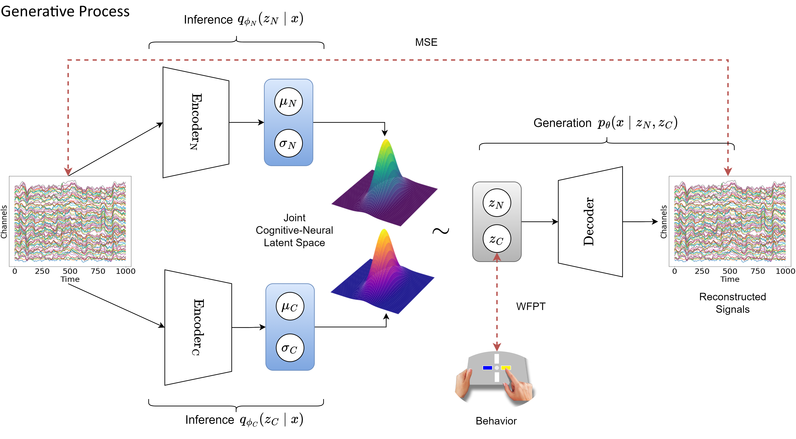
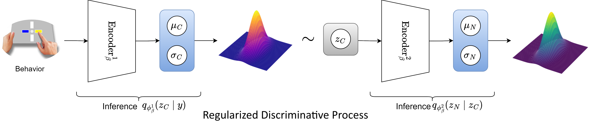

# Codebase for "Deep Latent Variable Joint Cognitive Modeling of Neural Signals and Human Behavior"

Paper link: https://www.sciencedirect.com/science/article/pii/S1053811924000545

## The Neurocognitive VAE (NVCA)

(a) Generative Process:



(b) Regularized Discriminative Process:



After the generative process (a) learns the joint latent neurocognitive variables (Section \ref{gen}), the regularized discriminative process (b) retrofits its hierarchical latent space to the joint latent space (Section \ref{disc}). Inference networks $q$ and Generation networks $p$ contain neural network parameters $\theta$ and $\phi$. Black arrows: flows of operations. Red arrows: loss functions. MSE and WFPT stand for Mean Squared Error and Wiener First Passage Time, respectively. The heatmaps represent the probability distributions in the latent spaces. Plasma color maps are for the drift-diffusion variables ($z_C \in \mathbb{R}^{3}$), while greenery color maps are for residual neural variables ($z_N \in \mathbb{R}^{32}$). Blue blocks contain $\mu$ and $\sigma$, which are the parameters of the multivariate Gaussian latent spaces. Gray blocks contain $z$ sampled ($\sim$) from the distributions. The variables $x$ and $y$ represent EEG signals and choice-RTs, respectively. Each trapezoid represents a different convolutional neural network.

## Setup

To install the dependencies, you can run in your terminal:
```sh
pip install -r requirements.txt
```

Experimental dataset can be downloaded at: https://zenodo.org/records/8381751

## Usage

The code is structured as follows:
- `preprocessing.ipynb` preprocessed the downloaded dataset.
- `data.py` contains functions to transform and feed the data to the model.
- `models.py` defines deep neural network architectures.
- `utilities.py` has utilities for evaluation and plottings.
- `train.py` is the main entry to run the training process.
- `evaluation.ipynb` runs the evaluation.

## Citation

If you find this code helpful, please cite our paper:

    @article{vo2024deep,
        title={Deep latent variable joint cognitive modeling of neural signals and human behavior},
        author={Vo, Khuong and Sun, Qinhua Jenny and Nunez, Michael D and Vandekerckhove, Joachim and Srinivasan, Ramesh},
        journal={NeuroImage},
        pages={120559},
        year={2024},
        publisher={Elsevier}
    }